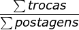
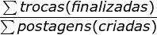

# sKanboo

**Ana Corina Damas Batista | <acorina59@gmail.com>**

**Giovanna Ferreira dos Santos de Almeida | <gfsalmeida@sga.pucminas.br>**

**Guilherme Lage da Costa | <guilhermeldcosta@gmail.com>**

**Lucas Cabral Soares | <1425177@sga.pucminas.br>**

**Vítor Lagares Stahlberg | <vitorls2001@gmail.com>**

---

Professores:

**Hugo Bastos de Paula**

**Eveline Alonso Veloso**

---

_Curso de Engenharia de Software, Unidade Praça da Liberdade_

_Instituto de Informática e Ciências Exatas – Pontifícia Universidade de Minas Gerais (PUC MINAS), Belo Horizonte – MG – Brasil_

---

_**Resumo**. Escrever aqui o resumo. O resumo deve contextualizar rapidamente o trabalho, descrever seu objetivo e, ao final, mostrar algum resultado relevante do trabalho (até 10 linhas)._

---

## 1. Introdução

### 1.1 Contextualização

O escambo é um modelo de comércio caracterizado pela troca direta de bens entre as pessoas, sem o uso de dinheiro. Nesse tipo de negociação, cada uma das partes envolvidas oferece algo que possui em troca de algo que necessita.

Apesar de ser uma prática antiga, o escambo vem ganhando cada vez mais força, em razão da crescente preocupação com a sustentabilidade e aplicação de premissas da economia circular[1], que prevê o uso e reuso de um recurso. Não obstante, o cenário de incerteza financeira gerado durante o período de pandemia fez com que diversas pessoas buscassem formas mais baratas de suprir as suas necessidades. Em [reportagem](https://g1.globo.com/sp/santos-regiao/noticia/2022/07/27/trocas-por-produtos-servicos-e-alimentos-escambo-ganha-forca-em-grupo-no-litoral-de-sp.ghtml) realizada pelo site G1 em julho de 2022, foi descrito um grupo de troca de objetos do Facebook que contava com mais de 6 mil usuários. Segundo a reportagem, esse grupo foi criado para auxiliar a comunidade local durante o período da pandemia, uma vez que podiam conseguir produtos de higiene ou mantimentos, por exemplo, sem gastar dinheiro com isso. Outro exemplo é o grupo [Escambaria](https://www.revide.com.br/noticias/revista/escambo-on-line-ganha-adeptos-e-grupos-nas-redes/), de Ribeirão Preto, que em 2015 já contava com mais de 6.700 usuários ativos. Segundo a criadora do grupo, móveis, eletrodomésticos, livros, jogos, instrumentos, quase tudo pode ser negociado.

O crescimento dos hábitos de consumo da população se mostrou mais expressivo a partir da transição gerada pela Revolução Industrial, que ocorreu em meados do século XVIII, segundo as Rotas Culturais do Conselho Europeu _European Route of Industrial Heritage_[2]. Desde então, acumular objetos tornou-se quase um hábito na vida de diversas pessoas, estes que, muitas vezes, estão em completo desuso. Para fins de exemplo, um índice comumente utilizado tem relação com o número de furadeiras para uso doméstico. Em grande parte das residências, é muito comum que os seus moradores tenham ao menos uma furadeira guardada. No entanto, o que muitos não sabem, é que durante toda a sua vida útil, essa furadeira é usada, em média, por apenas 40 minutos, segundo a Instituição Akatu[3]. Ou seja, um produto que na maior parte da sua vida útil, ficará em desuso.

Portanto, ao fazer escambo, as pessoas podem ser desfazer de bens que já possui (e que por ventura não utiliza), por outros que precisa, ganha mais flexibilidade por poder negociar diretamente com a outra parte, e também é uma forma mais sustentável de consumir.

### 1.2 Problema

Uma situação na qual grande parte da população já se deparou é de necessitar ou querer adquirir um determinado produto, mas não ter o dinheiro para isso no momento. Dado esse cenário, o mais comum que aconteça, caso a pessoa esteja em real necessidade do produto, é que ela o adquira, seja parcelando seu valor (incorrendo em juros) ou pegando empréstimos, por exemplo. Um outro cenário possível é que essa pessoa opte por um modelo de escambo, tentando trocar um objeto que já tem por esse outro que precisa. No entanto, pode ser difícil encontrar alguém interessado em adquirir seu produto, ou não conhecer ninguém que possua o que deseja.

Partindo desse pressuposto, seria possível criar uma plataforma que colocasse as pessoas dispostas a trocar objetos em contato? de forma que elas conseguissem se desfazer daqueles objetos que possuem e não usam, podendo obter o que querem sem ter que gastar com isso? Esse é o problema que será analisado e desenvolvido no projeto apresentado a seguir.

### 1.3 Objetivo geral

O objetivo geral do projeto em questão é desenvolver uma aplicação web que permita a troca de objetos entre os seus usuários.

#### 1.3.1 Objetivos específicos

Para desenvolver a aplicação descrita acima, mapeamos os seguintes objetivos específicos:

- Levantar os principais processos relacionados à troca de objetos;
- Desenvolver um banco de dados com as informações dos usuários cadastrados e objetos publicados;
- Desenvolver um sistema de autenticação e segurança dos dados dos usuários.

### 1.4 Justificativas

Com o **sKanboo**, as pessoas poderão trocar objetos que possuem, e não usam, sem estarem limitadas ao seu ciclo social para que isso aconteça. Dessa forma, será uma alternativa para se obter novos produtos, que não envolve dinheiro, ideal para as pessoas que estão interessadas em algo, mas não possuem o dinheiro no momento.

Além disso, a plataforma pode incentivar a sustentabilidade e o consumo consciente, pois os usuários estarão dando uma nova utilidade a objetos que poderiam ser descartados. A troca de produtos pode estimular a criação de uma comunidade de usuários que compartilham interesses e valores em comum, criando um ambiente mais colaborativo e solidário. Por fim, o escambo pode ser uma forma de experimentar novos itens sem se comprometer financeiramente, permitindo que os usuários testem produtos antes de decidir comprá-los definitivamente.

## 2. Participantes do processo

Todo o processo de negociação e eventual troca é realizado entre **usuários** do sistema. No contexto da troca em si, esses usuários podem assumir duas funções distintas, nomeadas **usuário 1** e **usuário 2**, cujas atividades são descritas a seguir:

**Usuário 1**

    * Publica seu produto na plataforma;
    * Aceita ou recusa trocas;
    * Avaliar negociação com outro usuário.

**Usuário 2**

    * Oferece um objeto seu em troca de outro publicado no site;
    * Caso sua oferta seja aceita, realizar a troca;
    * Avaliar negociação com outro usuário.

**Setor de Marketing**

    * Captar novos parceiros;
    * Gerenciar parceiros;

**Parceiro**

    * Custear o sistema.

## 3. Modelagem do processo de negócio

### 3.1. Análise da situação atual

Atualmente, o processo de escambo pode ser realizado das seguintes formas:

- **Boca a boca**: nesse modelo, a pessoa que possui um objeto que deseja trocar procura em seu círculo social alguém que possa ter interesse. Porém, essa troca é realizada de forma limitada, já que só é possível trocar um objeto com alguém próximo, como amigos, conhecidos ou familiares, por exemplo. Além disso, se uma outra pessoa estiver interessada no objeto que você tem para oferecer, mas não tiver nada que você queira em troca, a troca pode não acontecer, deixando ambos os produtos em desuso com seus respectivos donos;

- **Grupos de conversa**: existem grupos em redes sociais, como o Facebook, que possuem como objetivo a troca de produtos entre seus usuários. Esses grupos oferecem maiores possibilidades de troca do que o modelo "boca a boca", mas ainda estão restritos aos usuários que participam da rede social e do grupo específico;

- **Feira de trocas**: são eventos organizados em locais públicos, como praças ou parques, com o objetivo de promover a troca de objetos entre os participantes. Essas feiras podem ser organizadas por grupos de pessoas ou por órgãos públicos e geralmente possuem regras definidas para garantir a segurança e a organização do evento.

### 3.2. Descrição Geral da proposta

A proposta do **sKanboo** consiste em ampliar as maneiras de se realizar trocas, uma vez que buscar eliminar a limitação imposta pelo modelo clássico de trocas, na qual uma pessoa, de modo geral, só consegue trocar um objeto por outro com pessoas dentro do seu círculo social. Além disso, o usuário poderá avaliar diversas possibilidades diferentes, ao passo que consegue negociar e fazer ofertas com vários outros usuários simultaneamente. Neste sentido, o fluxo da aplicação seguirá as seguintes etapas:

- O usuário acessa a plataforma e se cadastra, fornecendo dados básicos como nome, email, senha, cpf, telefone e data de nascimento;
- Feito o cadastro, o usuário estará apto para cadastrar uma postagem que deseja publicar para trocar ou procurar por produtos que deseja;
- Caso o usuário queira cadastrar um novo produto, ele deve preencher o formulário de cadastro com as informações desejadas e solicitar a sua publicação;
- Caso o usuário se interesse por um produto de outro usuário, ele pode fazer uma oferta no produto, que pode ser aceita ou recusada pelo usuário que o publicou;
- Após conclusão da troca, ambas as partes se avaliam no site, de modo que os bons usuários sejam reconhecidos.

A avaliação entre usuários é importante, pois fornece maior segurança à outra parte, uma vez que um usuário com boa nota indica que ele já realizou trocas bem sucedidas. Além disso, a aplicação busca se beneficiar com isso, de um crescimento de seus usuários de maneira orgânica, na base do "boca a boca", na qual um usuário que teve uma boa experiência pode indicar a aplicação para um conhecido, por exemplo.

### 3.3. Modelagem dos Processos

### 3.3.1 Processo 1 – Gerenciar usuário

O usuário se cadastra preenchendo os campos de "nome", "cpf", "e-mail", "senha", "data de nascimento", "telefone", "UF". Caso todas restrições de criação de usuário sejam contempladas, como, "cpf", "email" e "telefone" únicos, o usuário será criado. Além disso, o usuário cadastrado pode atualizar suas informações de cadastro.

### 3.3.2 Processo 2 – Gerenciar produtos

O usuário é capaz de adicionar um produto ou atualizar as informações de produto previamente cadastrado.

### 3.3.3 Processo 3 – Cooptar parceiros

O setor de Marketing irá enviar uma proposta de parceria para o parceiro selecionado. Este parceiro deve decidir se vai aceitar ou nao proposta, caso não seja aceita o processo será encerrado. Caso contrário, o setor de Marketing deve realizar o cadastro do novo parceiro e, a partir disto, o sistema passará automaticamente a divulgar este parceiro na plataforma do **sKanboo**.

### 3.3.4 Processo 4 – Troca de objetos entre usuários

Quando uma postagem de seu interesse for encontrada, o usuário pode oferecer, em troca, um outro produto seu, que também deve estar postado na plataforma. Caso o usuário aceite a troca, os dados de contato de ambos os usuários envolvidos serão encaminhados para que eles possam definir melhor como a troca será feita.

### 3.3.5 Processo 5 – Avaliação do usuário

O usuário deve acessar o status de negociações e selecionar a negociação que quer avaliar. Em seguida, pode deixar avaliação positiva, neutra ou negativa e escrever um comentário.

## 4. Projeto da Solução

### 4.1. Detalhamento das atividades

#### Processo 1 – Gerenciar usuário

**Login de usuário**

| **Campo**          | **Tipo**       | **Restrições**                                                                  | **Valor default** |
| ------------------ | -------------- | ------------------------------------------------------------------------------- | ----------------- |
| E-mail             | Caixa de texto | Formato de e-mail                                                               | -                 |
| Senha              | Caixa de texto | Mínimo 12 caracteres com no mínimo uma letra, um número e um caractere especial | -                 |
| Criar conta        | Link           | Link único                                                                      | -                 |

**Cadastro de usuário**

| **Campo**          | **Tipo**       | **Restrições**                                                                  | **Valor default** |
| ------------------ | -------------- | ------------------------------------------------------------------------------- | ----------------- |
| Nome               | Caixa de texto | Texto com no máximo 100 caracteres                                              | -                 |
| E-mail             | Caixa de texto | Formato de e-mail                                                               | -                 |
| Senha              | Caixa de texto | Mínimo 12 caracteres com no mínimo uma letra, um número e um caractere especial | -                 |
| Data de Nascimento | Data           | Formato dd/mm/aaaa e anterior a data corrente                                   | -                 |
| CPF                | Número         | 11 números                                                                      | -                 |
| Telefone           | Caixa de texto | Telefones seguindo plano de numeração brasileiro                                | -                 |

**Cadastro de endereço**

| **Campo**   | **Tipo**       | **Restrições**                    | **Valor default** |
| ----------- | -------------- | --------------------------------- | ----------------- |
| Bairro      | Caixa de texto | Texto com no máximo 45 caracteres | -                 |
| CEP         | Caixa de texto | Texto com no máximo 45 caracteres | -                 |
| Cidade      | Caixa de texto | Texto com no máximo 45 caracteres | -                 |
| Complemento | Caixa de texto | Texto com no máximo 45 caracteres | -                 |
| Número      | Número         | -                                 | -                 |
| Rua         | Caixa de texto | Texto com no máximo 45 caracteres | -                 |
| UF          | Seleção única  | Lista de UFs do Brasil            | -                 |

**Atualizar informações de usuário**

| **Campo** | **Tipo**       | **Restrições**                                   | **Valor default** |
| --------- | -------------- | ------------------------------------------------ | ----------------- |
| Nome      | Caixa de texto | Texto com no máximo 100 caracteres               | Nome atual        |
| Foto      | Arquivo        | Máximo de 1 foto                                 | Foto atual        |
| Telefone  | Caixa de texto | Telefones seguindo plano de numeração brasileiro | Telefone atual    |
| UF        | Seleção única  | Lista de UFs do Brasil                           | -                 |

**Atualizar informações de endereço**

| **Campo**   | **Tipo**       | **Restrições**                    | **Valor default** |
| ----------- | -------------- | --------------------------------- | ----------------- |
| Bairro      | Caixa de texto | Texto com no máximo 45 caracteres | Bairro atual      |
| CEP         | Caixa de texto | Texto com no máximo 45 caracteres | CEP atual         |
| Cidade      | Caixa de texto | Texto com no máximo 45 caracteres | Cidade atual      |
| Complemento | Caixa de texto | Texto com no máximo 45 caracteres | Complemento atual |
| Número      | Número         | -                                 | Número atual      |
| Rua         | Caixa de texto | Texto com no máximo 45 caracteres | Rua atual         |
| UF          | Seleção única  | Lista de UFs do Brasil            | UF atual          |

#### Processo 2 – Gerenciar produtos

**Consultar produtos**

| **Campo**         | **Tipo** | **Restrições** | **Valor default** |
| ----------------- | -------- | -------------- | ----------------- |
| Editar            | Link     | Link único     | -                 |
| Adicionar produto | Link     | Link único     | -                 |
| Excluir produto   | Link     | Link único     | -                 |

**Cadastro de produto**

| **Campo**              | **Tipo**       | **Restrições**                                       | **Valor default** |
| ---------------------- | -------------- | ---------------------------------------------------- | ----------------- |
| Título                 | Caixa de texto | Máximo de 30 caracteres                              | -                 |
| Descrição              | Caixa de texto | Máximo de 140 caracteres                             | -                 |
| Adicionar foto         | Arquivo        | Máximo de 1 fotos                                    | -                 |
| Categoria do produto   | Seleção única  | [Eletrônicos, Moda e beleza, Música, Casa, Serviços] | -                 |
| Categoria de interesse | Seleção única  | [Eletrônicos, Moda e beleza, Música, Casa, Serviços] | -                 |

**Atualizar informações do produto**

| **Campo**              | **Tipo**       | **Restrições**                                       | **Valor default**          |
| ---------------------- | -------------- | ---------------------------------------------------- | -------------------------- |
| Título                 | Caixa de texto | Máximo de 30 caracteres                              | Título atual               |
| Descrição              | Caixa de texto | Máximo de 140 caracteres                             | Descrição atual            |
| Adicionar foto         | Arquivo        | Máximo de 1 fotos                                    | Foto atual                 |
| Categoria do produto   | Seleção única  | [Eletrônicos, Moda e beleza, Música, Casa, Serviços] | Categoria do produto atual |
| Categoria de interesse | Seleção única  | [Eletrônicos, Moda e beleza, Música, Casa, Serviços] | Categoria desejada atual   |

**Página do produto**

| **Campo**         | **Tipo** | **Restrições** | **Valor default** |
| ----------------- | -------- | -------------- | ----------------- |
| Negociar          | Link     | Link único     | -                 |

#### Processo 3 – Cooptar parceiros

**Cadastro de parceiro**

| **Campo**         | **Tipo**       | **Restrições**             | **Valor default** |
| ----------------- | -------------- | -------------------------- | ----------------- |
| Nome fantasia     | Caixa de texto | Máximo de 100 caracteres   | -                 |
| Logo da empresa   | Arquivo        | Máximo 1 foto              | -                 |
| CNPJ              | Número         | Máximo de 14 dígitos       | -                 |
| Plano de parceria | Seleção única  | [Basic, Standard, Premium] | -                 |
| Contrato          | Arquivo        | No máximo 5 PDF            | -                 |

**Atualizar informações do parceiro**

| **Campo**       | **Tipo**       | **Restrições**           | **Valor default** |
| --------------- | -------------- | ------------------------ | ----------------- |
| Nome fantasia   | Caixa de texto | Máximo de 100 caracteres | Nome atual        |
| Logo da empresa | Arquivo        | Máximo 1 foto            | Logo atual        |

#### Processo 4 – Troca de objetos entre usuários

**Escolher produto**

| **Campo**                                         | **Tipo** | **Restrições** | **Valor default** |
| ------------------------------------------------- | -------- | -------------- | ----------------- |
| Selecionar produto que desejada oferecer em troca | Seleção única  | Obrigatório     | -                 |
| Negociar                                          | Link     | Link único     | -                 |

**Minhas trocas**

| **Campo**                                         | **Tipo** | **Restrições** | **Valor default** |
| ------------------------------------------------- | -------- | -------------- | ----------------- |
| Ver produto ofertado                              | Link     | Link único     | -                 |
| Ver produto que deseja                            | Link     | Link único     | -                 |
| Cancelar oferta                                   | Link     | Link único     | -                 |

**Preview da oferta**

| **Campo**                                         | **Tipo** | **Restrições** | **Valor default** |
| ------------------------------------------------- | -------- | -------------- | ----------------- |
| Negociar                                          | Link     | Link único     | -                 |

#### Processo 5 – Avaliação do usuário

**Avaliar negociação**

| **Campo**         | **Tipo**       | **Restrições**           | **Valor default** |
| ----------------- | -------------- | ------------------------ | ----------------- |
| Avaliar serviço   | Seleção única  | Obrigatório              | -                 |
| Avaliação escrita | Caixa de Texto | Máximo de 140 caracteres | -                 |

### 4.2. Tecnologias

As tecnologias que serão utilizadas para resolução do problema são:

| Tecnologia ou ferramenta | Utilização                                                                                  |
| ------------------------ | ------------------------------------------------------------------------------------------- |
| GitHub                   | Versionamento dos arquivos em repositório remoto                                            |
| Git                      | Gerenciamento das versões dos arquivos                                                      |
| Figma                    | Plataforma para design gráfico, usada para criar a estilização do site                      |
| Photoshop                | Utilizado para o design do Style Guide                                                      |
| WhatsApp                 | Usado para facilitar a comunicação entre os participantes do grupo                          |
| Discord                  | Utilizado para realizar reuniões com os participantes do trabalho para organizar as tarefas |
| Visual Studio Code       | Editor de código                                                                            |
| HTML                     | Linguagem de marcação utilizada                                                             |
| CSS                      | Linguagem de estilização utilizada                                                          |
| Javascript               | Linguagem de programação utilizada para manipular elementos da pagina da aplicação          |
| Java                     | Linguagem de programação utilizada para codificar o back-end                                |
| Vue JS                   | Framework front-end para fazer requisições da API e apresenta-las no navegador              |
| Chart JS                 | Biblioteca para geração de gráficos dinâmicos                                               |
| SpringBoot               | Framework back-end utilizado para criar e gerenciar as entidades em um banco de dados       |
| MySQL Workbench          | Ferramenta de design de banco de dados                                                      |
| Postman                  | Plataforma de teste dos endpoints da API                                                    |
| HeideSQL                 | Software utilizado para visualizar o banco de dados criado                                  |

A seguir é apresentada a arquitetura de data flow da aplicação web.

## 5. Modelo de dados

A seguir é apresentado o Diagrama de Entidade-Relacionamento (DER) do projeto desenvolvido.

## 6. Indicadores de desempenho

A seguir são apresentados os indicadores utilizados no projeto.

| **Indicador**                           | **Objetivos**                                                               | **Descrição**                                                | **Cálculo**                                                           | **Fonte dados**            | **Perspectiva** |
| --------------------------------------- | --------------------------------------------------------------------------- | ------------------------------------------------------------ | --------------------------------------------------------------------- | -------------------------- | --------------- |
| Número de contas criadas mensalmente    | Avaliar quantidade de novas contas criadas                                  | Acompanha o número de usuários criados mensalmente           |                                               | Tabela de usuários         | Crescimento     |
| Número de postagens criadas mensalmente | Avaliar quantidade de novas postagens criadas                               | Acompanha o número de postagens criadas mensalmente          |                                            | Tabela de postagem         | Crescimento     |
| Categorias mais ofertadas e buscadas    | Medir a relação entre as categorias mais ofertadas e as mais desejadas      | Compara quais categorias são mais requisitadas               |  e                  | Tabela de postagem         | Desempenho      |
| Taxa de criação de trocas               | Avaliar o número de trocas criadas em relação ao número de postagens no mês | Verifica quantas postagens foram envolvidas em trocas no mês |           | Tabela de troca e postagem | Desempenho      |
| Taxa de conclusão de trocas             | Avaliar quantas trocas são efetivamente finalizadas no mês                  | Acompanhar quantas trocas foram finalizadas no mês           |  | Tabela de troca            | Desempenho      |

## 7.Sistema desenvolvido

O software desenvolvido consiste em um site de trocas do tipo escambo no qual o usuário possui a opção de cadastro para poder realizar as trocas. O sistema visa agilizar o processo de troca e funciona da seguinte forma:

#### Tela Inicial

A tela inicial contém anúncios randomicamente selecionados para o usuário. 

#### Tela de Login

A tela de login contém a opção de acesso ao sistema através dos campos 'Email' e 'Senha'. Caso o usuário nãp possua um cadastro, ele consegue se cadastrar na plataforma através do botão 'Criar uma conta'.

#### Tela de Cadastro

O usuário deve preencher os campos 'Nome', 'Email', 'Senha', 'Data de Nascimento', 'CPF' e 'Telefone' para realizar o cadastro de uma nova conta.

#### Tela de Informações da Conta

A tela de informações da conta exibe os campos 'Nome', 'Nascimento', 'Email', 'Telefone', 'Senha', 'CPF' e 'Endereço', referentes a conta do usuário. Contém também os botões 'Editar endereço', que direciona o usuário para a página de edição do endereço, 'Editar', que direciona o usuário para a página de editar a conta e 'Sair', que faz o logout do usuário. 

#### Tela de Editar Endereço

O usuário pode preencher os campos 'UF', 'CEP', 'Cidade', 'Bairro', 'Rua', 'Número' e 'Complemento' para realizar a edição do endereço ou clicar no botão 'Cancelar' para cancelar a edição.

#### Tela de Alterar Informações da Conta

O usuário pode preencher os campos 'Adicionar foto', 'Editar nome', 'Editar telefone' e 'UF' para realizar a edição de informações da conta ou clicar no botão 'Cancelar' para cancelar a edição. 

#### Tela 'Meus Anúncios'

A tela 'Meus Anúncios' exibe os anúncios do usuário e contém os botões 'Editar', que direciona o usuário para a página de editar o produto e 'Excluir', que exclui o anúncio.

#### Tela de Editar Produto

O usuário pode preencher os campos 'Adicionar foto', 'Título', 'Descrição', 'Selecione a categoria do produto' e 'Selecione a categoria de interesse' para realizar a edição de informações do produto.

#### Tela do Produto

Exibe as informações do produto ('Categoria', 'Interesse', 'Local', 'Postado por', 'Título' e 'Descrição') e o botão 'Negociar', que direciona o usuário para a página de seleção de um produto para ser oferecido em troca.

#### Tela 'Selecione um produto para oferecer em troca'

Exibe os produtos postados pelo usuário para que ele possa selecionar um e oferecer em troca do produto desejado.

#### Tela de Prévia da Troca

Exibe o produto que o usuário está ofertando e o produto que o usuário deseja.

#### Tela de Ofertas Feitas

Exibe as ofertas realizadas pelo usuário e contém um filtro que permite que o usuário selecione os status de oferta que deseja ver ('Recusada' e 'Em andamento').

#### Tela de Ofertas Recebidas

Exibe as ofertas recebidas pelo usuário e contém um filtro que permite que o usuário selecione os status de oferta que deseja ver ('Recusada' e 'Em andamento').

#### Tela de Avaliação

Consiste em uma tela que aparece após o status da trocar ser dado como finalizado por ambas as partes, permitindo que os dois usuários possam selecionar um 'emoji' para avaliar o que acharam da troca.

## 8. Conclusão

O projeto Skanboo é um sistema que pretende auxiliar na realização do escambo, a fim de aumentar ainda mais a aplicação da economia circular[1] e dos princípios da sustentabilidade, além de conectar o usuário com um número de pessoas que vai além do seu ciclo social. Para isto foi criada uma interface amigável e intuitiva que permite que o usuário consiga transitar pelo sistema sem muitas dificuldades.

Após a definição do problema que seria abordado, foram discutidas inúmeras formas para a implementação de uma solução, dentre elas uma que fazia uso de moedas digitais, até concluir-se que a proposta mais fiel aos príncipios sustentáveis do sistema seria a que permitia somente a troca de bens e serviços por estes mesmos. É necessário, no futuro, avaliar abordagens para realizar algumas melhorias no sistema, como por exemplo migrar todo o processo de troca para dentro do site, ao invés de apenas informar o contato dos usuários envolvidos. Com isso, finaliza-se a entrega da primeira versão do projeto.

# REFERÊNCIAS

Verifique no link abaixo como devem ser as referências no padrão ABNT:

<http://www.pucminas.br/imagedb/documento/DOC\_DSC\_NOME\_ARQUI20160217102425.pdf>

**[1]** - _Economia Circular - O que é a Economia Circular? ([s.d.]). Nomia.pt. Recuperado 2 de março de 2023, de <https://eco.nomia.pt/pt/economia-circular/estrategias>_

**[2]** - _European route of industrial heritage - cultural routes - publi.coe.int. ([s.d.]). Cultural Routes. Recuperado 2 de março de 2023, de <https://www.coe.int/en/web/cultural-routes/european-route-of-industrial-heritage>_

**[3]** - _Akatu, E. (2012, outubro 11). Como o consumo colaborativo pode revolucionar uma cidade. Instituto Akatu; Akatu. <https://akatu.org.br/como-o-consumo-colaborativo-pode-revolucionar-uma-cidade/>_

# APÊNDICES

[Código](https://github.com/ICEI-PUC-Minas-PPLES-TI/plf-es-2023-1-ti2-0924100-skanboo/tree/master/src)

[Artefatos](https://github.com/ICEI-PUC-Minas-PPLES-TI/plf-es-2023-1-ti2-0924100-skanboo/tree/master/assets)

[Apresentação final](https://github.com/ICEI-PUC-Minas-PPLES-TI/plf-es-2023-1-ti2-0924100-skanboo/blob/master/docs/sKanboo_Final.pdf)

Do vídeo de apresentação (armazenado no repositório).
